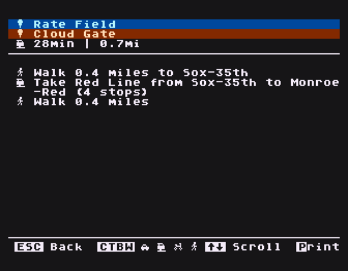

# FujiNav

Get navigation directions on your vintage computer with [FujiNet](https://fujinet.online).

 


## Self-hosting server
The server is configurable. If you would like to run your own instance, see https://github.com/nwah/fujisuite-server

## building

To build the application ensure you have the correct compiler/linker for your platform (e.g. cc65), and
make on your path, then simply run make.

```shell
# to clean all artifacts, run this on its own
make clean

# to generate the application for all targets
make release

# to generate a "disk" (e.g. PO/ATR/D64)
make disk
```

As per normal cc65 rules, you can add `TARGETS=...` value to the command to only affect the named target(s) if you
are building a cross compiled application:

```shell
# just the apple2enh, and c64 targets
make TARGETS="apple2enh c64" release
```

The default list of targets can be edit in [Makefile](Makefile). Remove any entries for targets you do not
wish to build.

## Makefile breakdown

The build uses a Makefile which delegates to other mk files for compiling and building disks etc.
The sources for these files are in the [makefiles](makefiles) subdirectory.

The first file that Makefile loads is [build.mk](makefiles/build.mk), which loads other makefiles as required if
they exist, and then creates the `release` task which is the main build task. There is also an `all` task which
is default and will do the same thing as release.

If your application needs to add some custom configuration, this can be done in `application.mk` in the root dir.

This will be sourced during compilation and allows you to shape the build how you want, for instance
you could add a `src/include` dir to the C and ASM paths so that you can place all header files in one location,
if this is your desire.

```make
ASFLAGS += --asm-include-dir $(SRCDIR)/include
CFLAGS += --include-dir $(SRCDIR)/include
```

Alternatively you are free to hack the build.mk file at your pleasure.
